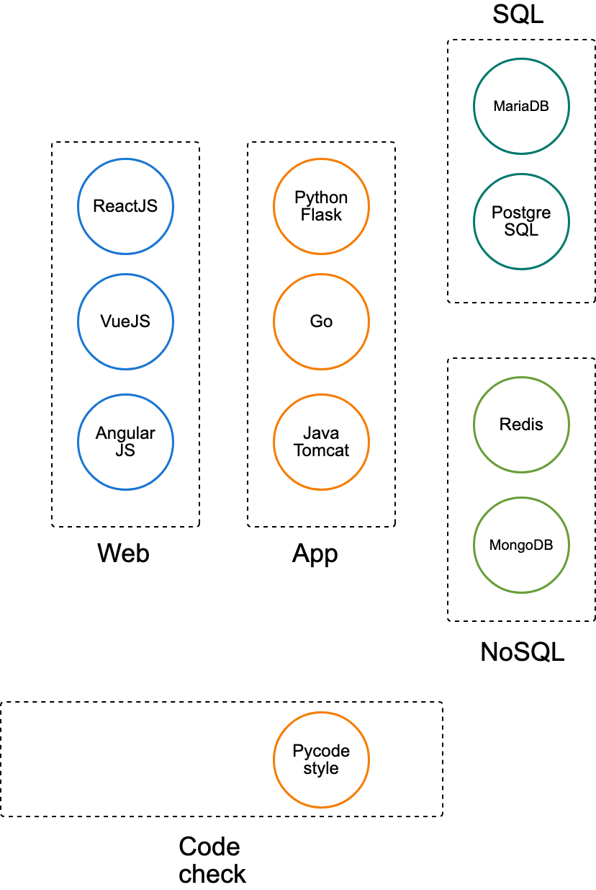

# To run the API server
You need a `config.py` file containing API keys or other sensitive information.
1. Install python3.6+ and pip on your machine.
2. `$ cd build/devops_api`
3. `$ pip install -r requirements.txt`
4. `$ mv _environments.json environments.json` # Or just place downloaded `environments.json` from somewhere else here
5. `$ mv _k8s_config into $HOME/.kube/config` # Put kubernetes config file into $HOME/.kube/config
5. `$ py apis/api.py` # Replace `py` command with your python3 executable on your platform

# DevOps and testing integration platform on kubernetes

----
## Framework

## Software components

# Migrate from pre-Harbor version to V0.9.2
1. API/migrate?command=cleanup_change_to_orm
2. Update database with `alembic`
3. API/migrate?command=create_harbor_projects
4. API/migrate?command=create_harbor_users
